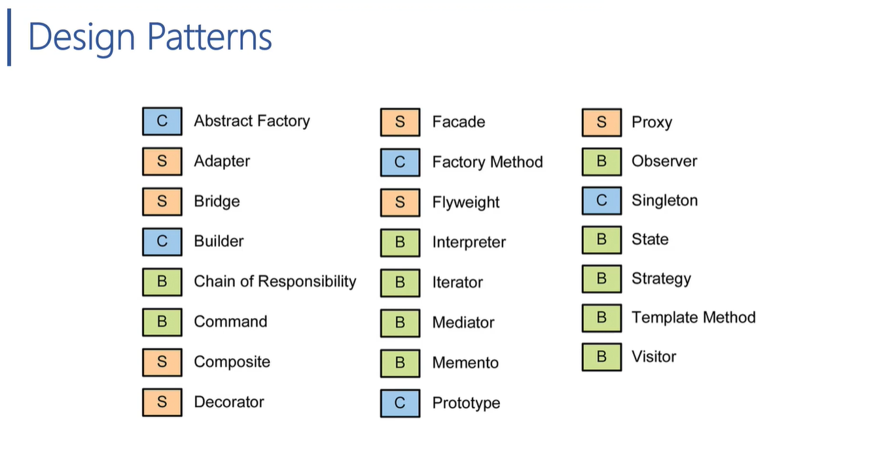
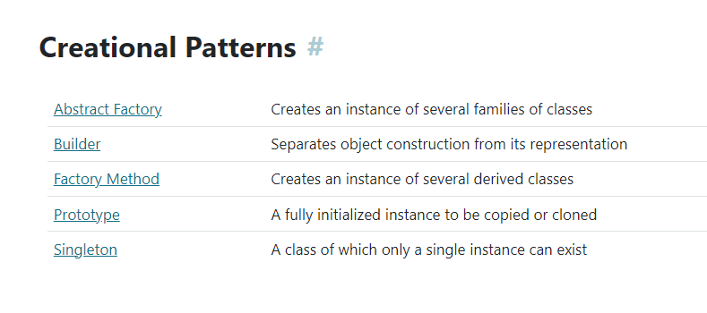
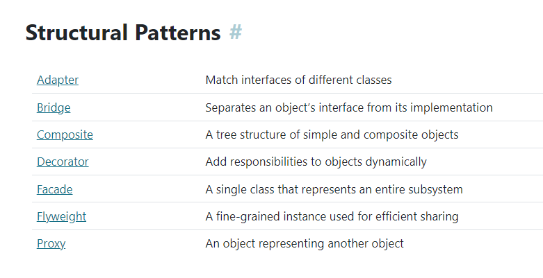
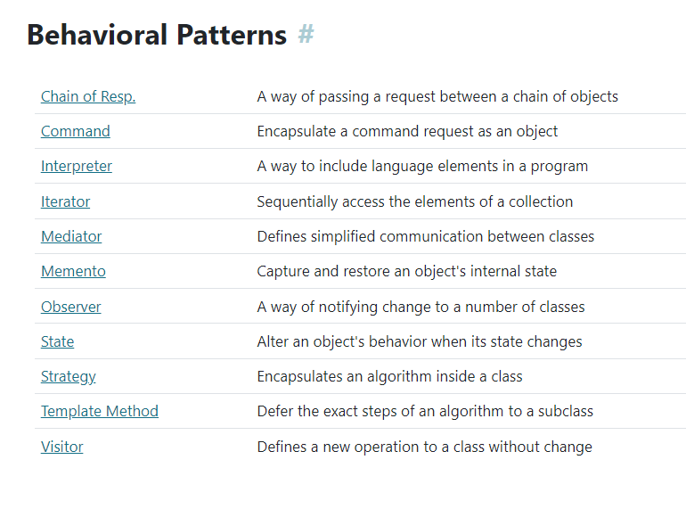
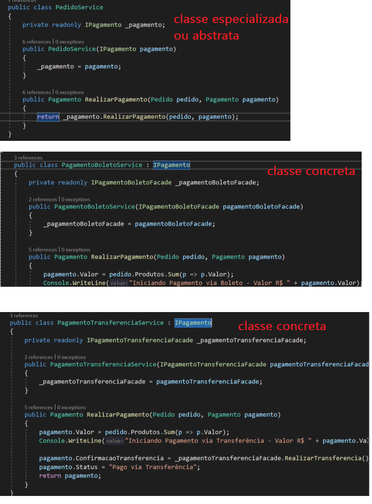

---------------------------------------------------
# Design Patterns
> Conceito do "Gang of four" (GOF) "que foi introduzida por 4 desenvolvedores". Hoje conta com 23 padrões fundamentais

Separado por 3 Famílias
## > Creational Pattern ⭐
Criação de um objeto , como ele é instanciado

## > Structural Pattern
Composição de um objeto/Interface/herança para diferentes funcionalidades

## > Behavior Pattern
Interações e comunicação entre os objetos, além da divisão entre responsabilidades

 

> Mais detalhes: https://www.dofactory.com/net/design-patterns

## ✔️ Patther Strategy
- Trabalha junto com o princípio SOLID do (open-closed - principio do aberto fechado), e Inversão de controler (pela interface)
- não precisa adicionar vários "If s" , basta criar a especialização baseado na interface.
exemplo abaixo: temos classe especializada que faz a função principal, mas temos classes concretas onde são executadas pela instância da interface. (como uma factory)

---------------------------------------------------

# Controller > Services > Repository
# View > Business > Data

# Onion Architecture

## Camada Api/View (Api) é a mais external
- Conversa com o Domain
- Conversa com a Infrastructure

## Camada de Infrastructure (Data)
- Conversa com o Domain

## Camada Domain (Business) é a mais interna
- não depender de ninguém

#HealthCheck 
- https://github.com/Xabaril/AspNetCore.Diagnostics.HealthChecks

---------------------------------------------------------
# Pacotes
> UTILIZAR CUSTOM RESPONSE, PARA TODOS ENDPOINTS (PADRÃO) 

- Install-Package AspNetCore.HealthChecks.SqlServer
- dotnet add package AutoMapper --version 11.0.1
- dotnet add package AutoMapper.Extensions.Microsoft.DependencyInjection --version 11.0.0
- dotnet add package Microsoft.AspNetCore.Mvc.Versioning --version 5.0.0
- dotnet add package Microsoft.AspNetCore.Mvc.Versioning.ApiExplorer --version 5.0.0
- dotnet add package AspNetCore.HealthChecks.UI --version 6.0.5

